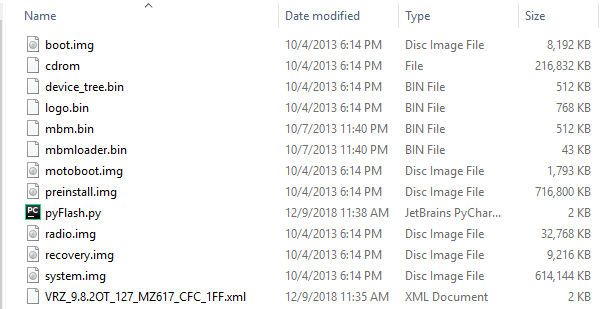

# MotoRDSFlash
Replaces the Motorolla RDS Lite software with a simple python script. The RDS Lite software is buggy, and this script allows you to flash software quicker and more reliably than with RDS Lite. 

# Instructions
Place the pyFlash.py script in the folder containing the unzipped firmware. Ensure that fastboot is in your system PATH, and that you have the correct fastboot drivers for your device.

# File Structure

